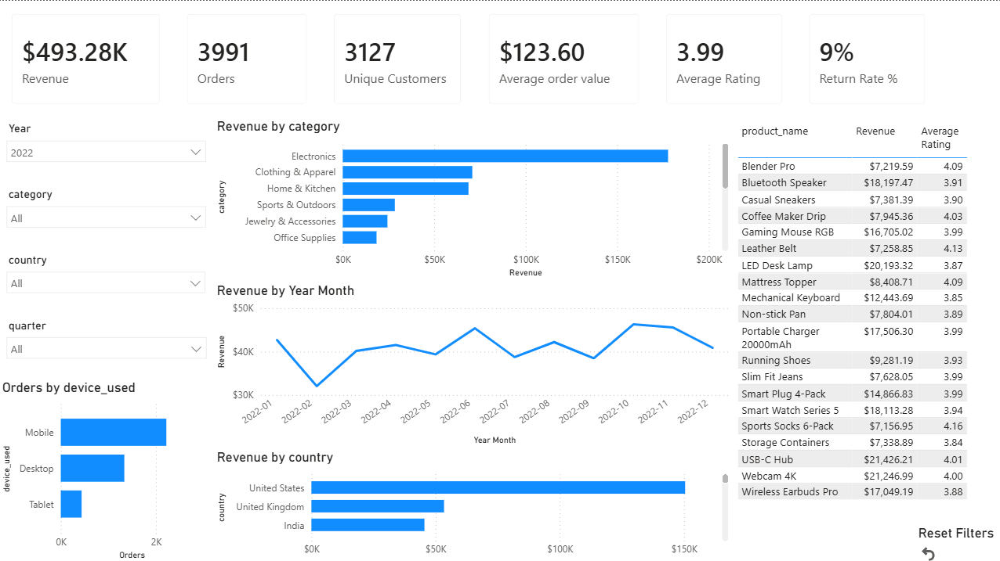
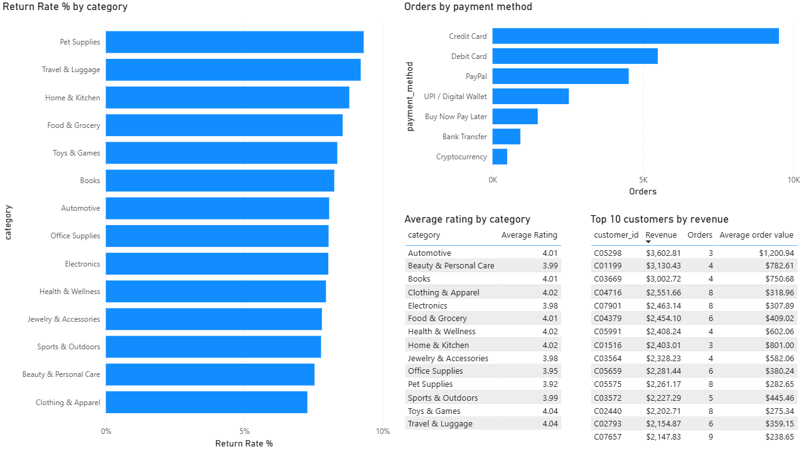
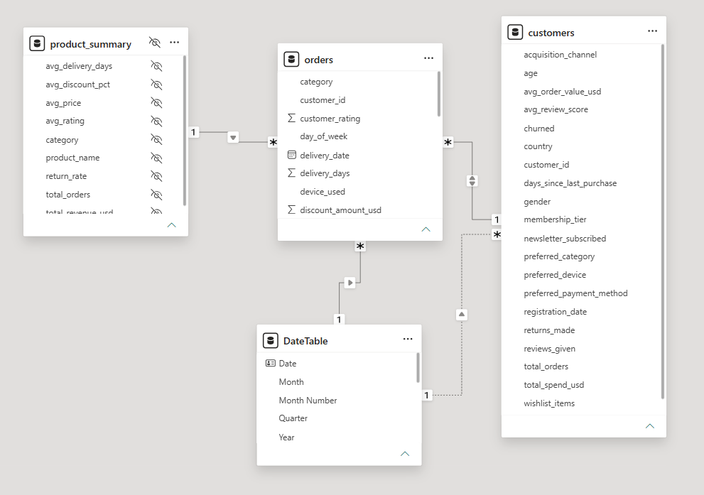

# 📊 E-commerce Sales Dashboard (Power BI)

## Overview

This project is an interactive Power BI dashboard built using an e-commerce dataset.

The goal of the dashboard is to analyze sales performance, customer behavior, product performance, and key business metrics through interactive visualizations.

The report was built using Power BI, DAX measures, and a star schema data model.

---

## Dataset

The project is based on four CSV tables:

| Table | Description |
|-------|-------------|
| **orders** | Transaction-level sales data |
| **customers** | Customer information and purchasing behavior |
| **product_summary** | Product performance summary |
| **DateTable** | Custom calendar table created for time intelligence |

---

## Data Model

The dashboard uses a **star schema**.

### Fact table

- Orders

### Dimension tables

- Customers
- Product Summary
- Date Table

A custom **Date Table** was created and marked as the official calendar table to support time intelligence calculations and filtering.

---

## Dashboard Pages

### 📈 Executive Overview

The main dashboard provides an overview of business performance.

#### KPI Cards

- Revenue
- Orders
- Unique Customers
- Average Order Value
- Average Rating
- Return Rate %

#### Filters

- Year
- Quarter
- Category
- Country

#### Visualizations

- Revenue by Category
- Revenue Trend
- Revenue by Country
- Orders by Device
- Top Products Table

---

### 👥 Customer & Product Analysis

The second page focuses on customer and product insights.

#### Visualizations

- Top 10 Customers by Revenue
- Orders by Payment Method
- Return Rate by Category
- Average Rating by Category

---

## DAX Measures

The report includes custom DAX measures such as:

- Revenue
- Orders
- Unique Customers
- Repeat Customers
- Average Order Value
- Average Rating
- Average Delivery Days
- Average Discount %
- Return Rate %

---

## Features

- Interactive slicers
- Cross-filtering between visuals
- Custom Date Table
- Star schema data model
- KPI cards
- Business-oriented dashboard layout
- Reset Filters button using Bookmarks

---

## Skills Demonstrated

- Power BI
- Data Modeling
- Star Schema
- Relationships
- DAX
- Time Intelligence
- Dashboard Design
- Business KPI Analysis
- Interactive Reporting

---

## Tools

- Power BI Desktop
- DAX
- Power Query
- CSV

---

## Repository Structure

```
PowerBI-Ecommerce-Dashboard/
│
├── Dashboard.pbix
├── README.md
└── screenshots/
    ├── overview.png
    ├── customer_analysis.png
    └── data_model.png
```

---

## Dashboard Preview

### Executive Overview



---

### Overview 2



---

### Data Model



---

## What I Learned

While working on this project I practiced:

- building a star schema data model
- creating reusable DAX measures
- designing interactive dashboards
- creating business KPIs
- using slicers and cross-filtering
- organizing reports for business analysis

---

## Future Improvements

Possible future enhancements:

- Drill-through pages
- Tooltip pages
- Dynamic Top N selection
- Customer segmentation
- Additional business KPIs

---

## Author

**Matvii Beskrovnyi**

Junior Data Analyst Portfolio Project
